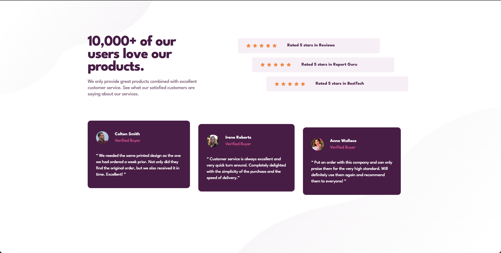

# Frontend Mentor - Social proof section solution

This is a solution to the [Social proof section challenge on Frontend Mentor](https://www.frontendmentor.io/challenges/social-proof-section-6e0qTv_bA).

## Table of contents

---

- [Overview](#overview)
  - [The challenge](#the-challenge)
  - [Screenshot](#screenshot)
  - [Links](#links)
- [My process](#my-process)
  - [Built with](#built-with)
  - [What I learned](#what-i-learned)
- [Author](#author)

## Overview

---

### The challenge

Users should be able to:

- View the optimal layout for the section depending on their device's screen size

### Screenshot



### Links

- Solution URL: [Github](https://github.com/gumrahsindar/social-proof-section)
- Live Site URL: [Vercel](https://social-proof-section-tfpa-gsindar.vercel.app/)

## My process

---

### Built with

- Semantic HTML5 markup
- CSS custom properties
- Flexbox
- CSS Grid
- Mobile-first workflow
- [React](https://reactjs.org/) - JS library
- [Tailwind CSS](https://tailwindcss.com/) - For styles
- [Vite](https://vitejs.dev/) - Build tool

### What I learned

In this project, I tried effective use of React by organizing the code into separate components for the rating and reviews sections. This approach improved code cleanliness and reusability. Additionally, I implemented the passing of props from parent components to their respective children, resulting in more maintainable and flexible code.

- Props usage example:

```jsx
<ul className='mb-12 mt-8 w-full flex-col'>
  <StarRating
    starIcon={starIcon}
    reviewText='Reviews'
    translateX='md:translate-x-0'
  />
  <StarRating
    starIcon={starIcon}
    reviewText='Report Guru'
    translateX=' md:translate-x-[10%]'
  />
  <StarRating
    starIcon={starIcon}
    reviewText='BestTech'
    translateX=' md:translate-x-[20%]'
  />
</ul>
```

- Rating component example:

```jsx
const StarRating = ({ starIcon, reviewText, translateX }) => {
  return (
    <li
      className={`mb-4 flex w-full flex-col items-center justify-start space-y-4 rounded-md bg-lightGrayishMagneta px-16 py-4 md:gap-10 md:space-y-0 md:px-8 xl:flex-row ${translateX} $`}
    >
      <div className='flex gap-3 md:gap-2'>
        
        
        
        
        
      </div>
      <p className='whitespace-nowrap text-[17px] font-bold text-veryDarkMagneta'>
        Rated 5 stars in {reviewText}
      </p>
    </li>
  )
}
```

- Review component example:

```jsx
const Reviews = ({ userData }) => {
  return (
    <>
      {userData.map((user) => (
        <div
          key={user.id}
          style={{ transform: user.transform }}
          className='rounded-xl bg-veryDarkMagneta px-8 py-10 text-white last:mb-24'
        >
          <div className='justify-senter mb-6 flex items-center gap-6 md:mb-8'>
            
            <div className='flex flex-col items-start'>
              <h3 className='text-[17px] font-bold'>{user.name}</h3>
              <h4 className='text-[17px] text-softPink'>{user.status}</h4>
            </div>
          </div>
          <p className='text-left text-[17px] font-medium leading-6 tracking-tight'>
            {user.text}
          </p>
        </div>
      ))}
    </>
  )
}
```

## Author

---

- LinkedIn - [Gümrah Sindar](https://www.linkedin.com/in/gumrahsindar/)
- Frontend Mentor - [@gumrahsindar](https://www.frontendmentor.io/profile/gumrahsindar)
- Twitter - [@gmrhsndr](https://twitter.com/gmrhsndr)
